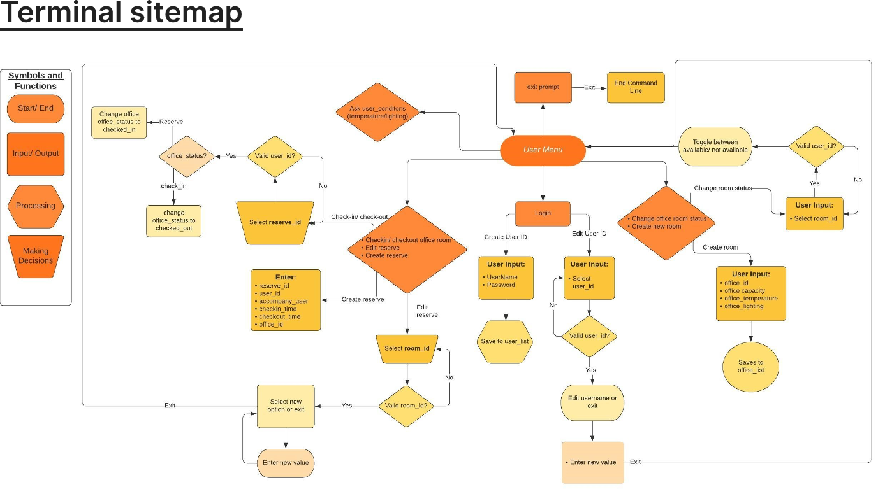
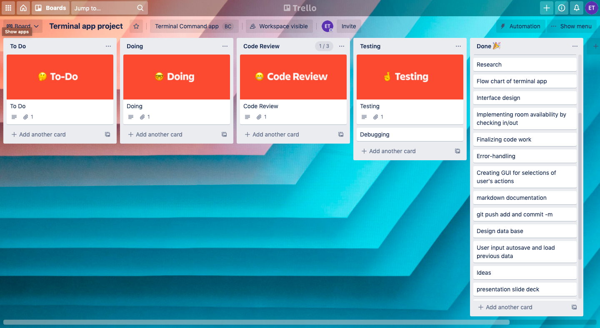
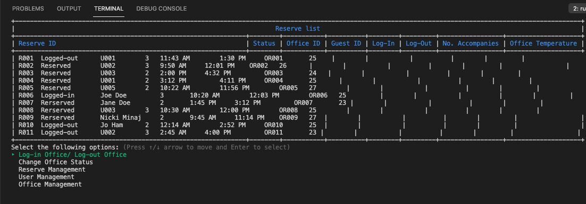

# Terminal Applciation T1A3
by  Ethan Tran GCAB0212122

## Description of Application 
This Ruby Terminal-App provide a user experience + smart building management solution for commercial buildings, company entitities. The app has multiple features that allows user to reserve/edit their office rooms as well as being able to adjust the temperature of the building base on preference with further implementation, AI usage could help assist in manage the terminal app more efficient at building energy consumption and productivity. 

## Application source code 
https://github.com/Neymartri/Terminal-App  
Trello Board: https://trello.com/b/XrgVcDfI/terminal-app-project 

## Developing and solving problems 
Commercial energy consumption has been a debating issue along with the overloaded of UI application that stall down the work productivity of workplace. This Applicaiton provides a multiple acessiblity of user experience and smart building application at the same time. Ultimately, saving times, easier to manage on one application and applying with AI technology to manage building more efficiently. 

## Target audience
Commercial entity and office manager 

## How to use for audience: 
Users can setup/edit their business office room, status of rooms, manage people in use, reservation room as well as a data listed under a table format. 

## Application Feature 
    I. Office manager user and office worker user: 
    1. Setting up and edit office rooms: 
    - Establish new office rooms when expand, adding  description (equipments, staionary), update current room temperature that will be intergrated with AI for better usage 
    2. Managing people:
    - Create new user profile, add email and phone number
    - check user reservation status for each office and who they accompanies with. 
    3. Intutitve display information 
    - Readability under table format, each table has headings that has title that can be update and save for future usage. 
    + 3 different table: 
    - The office table display rooms and reservation status of all rooms this include, room number, room status, occupiers, room capacity and a description of equipments included in the following room
    - The Reserve table: show the condition of each room and log-in and out time and current room temperature 
    - The user table: give each user a tag, their full name, email, phone number that can be update and expand. 
    3. Auto load and saving with terminal
    - All 3 mentioned tables are stored in 3 different csv file and will be loaded on to the application upon starting. 

## Development Outline - User Interactive manual
1. starting the application, a table of informaiton will be loaded and display a full list of options for user to decide and choose from  
2. When an option is selected, the user will be redirected to a relevant table of format that will provide further options of what user can do from the following catergory. 
3. Instructions are given to guide user to give valid input and expected arguments from the system and complete the aciton.  
4. error messages will be displayed for invalid user input and guide for appropriate input 

### <b>Features</b>

Following features of the app is listed:   
    + Main Menu:  
    - Log in/ out of office: change reservation status of the room  
    - Change office status: Ask user for input Office ID to update its status  
    - Reserve management: Acessing the reservation management feature fo editing and updating status of the room  
    - User Management: Acess user's profile/ updating and editing current user information
    - Office Management:  Office management features allow for expanding office rooms and adding description to the room status. 

## <u> Site-map and user interaciton design </u>

## <u> Thinking proccess and planning:</u>
Planning and time mangement was done in trello board

## <u> Structure: </u>
Via a MVC (Model View Control) the applicaiton will be structured and presented   
<b>- The Model:</b>  responsible for controlling all data related action + saving/loading data via csv files as it also taking in user input.  
<b>- The View: </b> presentation will be shown under user interface. This attirbute to the display of table format, ordering of option selecitons and user instructions.  
<b>- The Controller </b>: process any logic between User interface of View and the data related action of the Model. 

## <b> Requirement and installation </b> 
- Ruby version 3.0.1 is recommended 
- MacOS system is required  
- Required to run application through Ubuntu or VsCode  
- Do not resize terminal window  

# Installation 
- Ruby 
- Bundle Gem via terminal: install bundler 
- Download project to your computer by cloning repository 
- 4 gems are used in the projects: 
    - gem "tty-prompt", "~> 0.23.0"
    - gem "colorize", "~> 0.8.1"
    - gem "tty-spinner", "~> 0.9.3"
    - gem "terminal-table", "~> 3.0"

- Run the application from terminal app input: <b>ruby main.rb</b>

# <b> Command Line Interface </b>

End